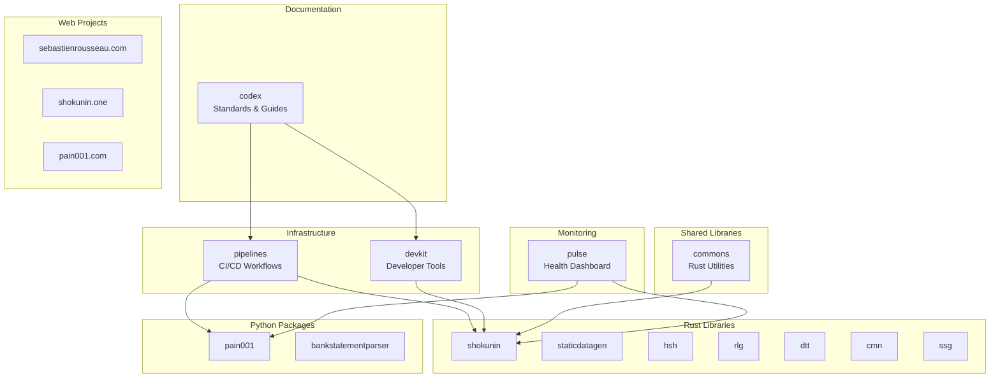
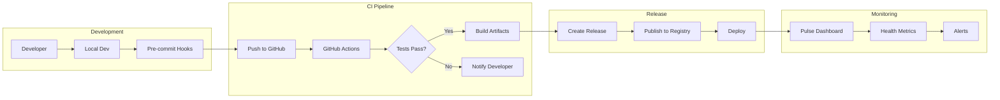
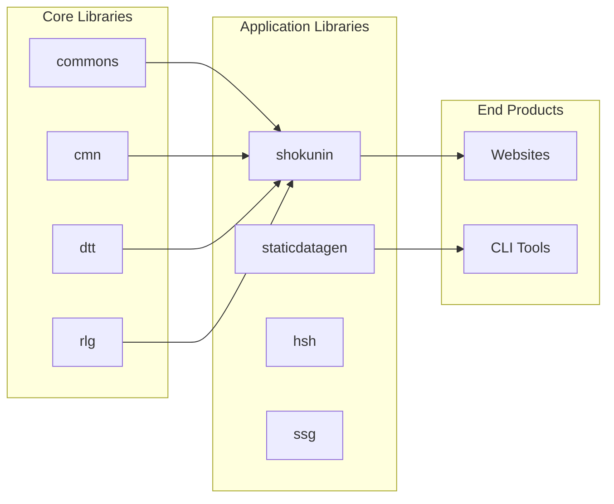
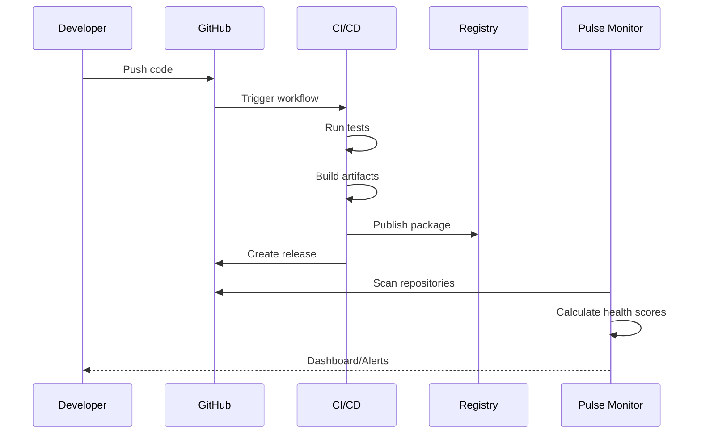

# Ecosystem Architecture

## Repository Structure

```mermaid
graph TB
    subgraph "Documentation"
        codex[codex<br/>Standards & Guides]
    end

    subgraph "Infrastructure"
        pipelines[pipelines<br/>CI/CD Workflows]
        devkit[devkit<br/>Developer Tools]
    end

    subgraph "Shared Libraries"
        commons[commons<br/>Rust Utilities]
    end

    subgraph "Monitoring"
        pulse[pulse<br/>Health Dashboard]
    end

    subgraph "Rust Libraries"
        shokunin[shokunin]
        staticdatagen[staticdatagen]
        hsh[hsh]
        rlg[rlg]
        dtt[dtt]
        cmn[cmn]
        ssg[ssg]
    end

    subgraph "Python Packages"
        pain001[pain001]
        bankstatementparser[bankstatementparser]
    end

    subgraph "Web Projects"
        sebastienrousseau[sebastienrousseau.com]
        shokunin_site[shokunin.one]
        pain001_site[pain001.com]
    end

    codex --> pipelines
    codex --> devkit
    pipelines --> shokunin
    pipelines --> pain001
    devkit --> shokunin
    commons --> shokunin
    pulse --> shokunin
    pulse --> pain001
```

## CI/CD Flow

```mermaid
flowchart LR
    subgraph "Development"
        A[Developer] --> B[Local Dev]
        B --> C[Pre-commit Hooks]
    end

    subgraph "CI Pipeline"
        C --> D[Push to GitHub]
        D --> E[GitHub Actions]
        E --> F{Tests Pass?}
        F -->|Yes| G[Build Artifacts]
        F -->|No| H[Notify Developer]
    end

    subgraph "Release"
        G --> I[Create Release]
        I --> J[Publish to Registry]
        J --> K[Deploy]
    end

    subgraph "Monitoring"
        K --> L[Pulse Dashboard]
        L --> M[Health Metrics]
        M --> N[Alerts]
    end
```

## Dependency Flow

```mermaid
graph LR
    subgraph "Core Libraries"
        commons[commons]
        cmn[cmn]
        dtt[dtt]
        rlg[rlg]
    end

    subgraph "Application Libraries"
        shokunin[shokunin]
        staticdatagen[staticdatagen]
        hsh[hsh]
        ssg[ssg]
    end

    subgraph "End Products"
        sites[Websites]
        tools[CLI Tools]
    end

    commons --> shokunin
    cmn --> shokunin
    dtt --> shokunin
    rlg --> shokunin
    shokunin --> sites
    staticdatagen --> tools
```

## Data Flow

```mermaid
sequenceDiagram
    participant Dev as Developer
    participant Git as GitHub
    participant CI as CI/CD
    participant Reg as Registry
    participant Pulse as Pulse Monitor

    Dev->>Git: Push code
    Git->>CI: Trigger workflow
    CI->>CI: Run tests
    CI->>CI: Build artifacts
    CI->>Reg: Publish package
    CI->>Git: Create release
    Pulse->>Git: Scan repositories
    Pulse->>Pulse: Calculate health scores
    Pulse-->>Dev: Dashboard/Alerts
```
